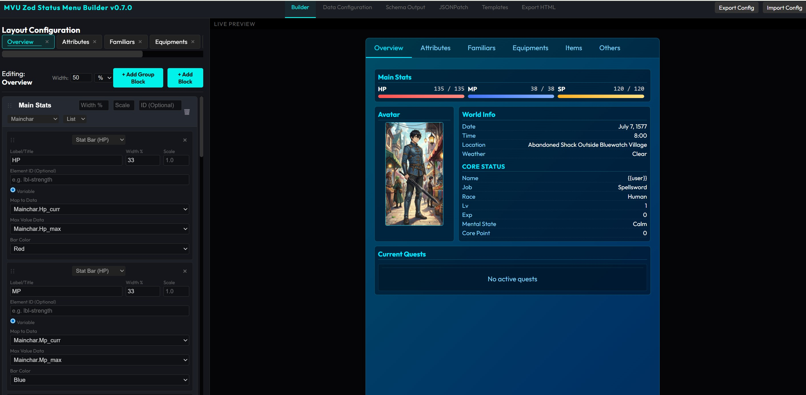

This is the Status Menu Builder for MVU Zod based character card.  It's a companion system that works with *any* MVU Zod based character card.  All the data will be saved locally on your computer and data will be persistent in Sillytavern.  Therefore, AI is NOT required to remember your stats nor the state of your characters.  The data is pull right out from a JSON file on your computer.  You just need to instruct how AI should add/update/remove data to the JSON file based on your rules in plain English or whatever language you use.  

Please see the demo at https://youtu.be/dOVmranK5yo

It's an advance builder that would allow you to build layout of the status menu in any browser by just clicking and dragging.  All you need to do is to download the release from https://github.com/KritBlade/MVU_Zod_StatusMenuBuilder/releases/tag/v0.7.0   (MZSMB_v0.7.0.zip).  Unzip the file and double click the index.html.  

The builder will allow you to build custom stats based on your design.  There is no limit on what stats or variable you want to design in the status menu builder.  It comes with "Data Configuration" utility that will allow you to build sample data for your design.  "Schema Output" utility will allow you to define what is the structure of your data so that AI will follow your format to save into the variable.  The JSONPatch utility will auto generate rules to instruct how to add/update/remove variables into your story.  So, if you design equipments with 'type', 'quantity', 'description', the JSONPatch rules will instruct AI how to add the equipments into your story.  All you need is to copy and paste the auto generated JSONPatch rules into the lorebook.  The Template system will allow you to completely change the color and fonts for the status menu you design.  It also allow you to create custom template on how you want to display listing of your items (inventory, equipments...etc).  

The system comes with advance logic that allow you to write javascript inside the builder so that you can inject logic like (if Mainchar.level > 70, then make my color of Mainchar.Name become red in color).   Any variable within the system you designed can be manipulated in the Advance logic.  Moreover, the system also allows you to retrieve content of *any* lorebook entry inside your story in SillyTavern.  So, you can have some powerful logic like (If Mainchar.Level > 70 then retrieve the image URL inside lorebook entry 'post-70-map' and display the image in the Map image section, else read the image URL inside lorebook entry 'pre-70-map' and display the image in the Map image)  As long as you know javascript, you can pretty much build any custom logic inside the builder.

You are required to install Tavern Helper extension as well as ST-prompt-Template extension in order to get the builder to work correctly in the character card.  You can see the full installation from https://www.youtube.com/watch?v=whRF0pJAzvs

1. Install Tavern Helper extension into SillyTavern from https://github.com/N0VI028/JS-Slash-Runner

2. Install ST-prompt-Template extension into SillyTavern from https://codeberg.org/zonde306/ST-Prompt-Template/

3. Download the Preset Izumi English version.  You will need to do some patch so that it works with English thinking and jailbreak as shown in the video.  The link to download the preset at https://discord.com/invite/C6HabNwzn7

4. Download the LATEST version of Artific Realm character card at https://github.com/KritBlade/ArtificRealm/tree/main/CharacterCard  (Click on the latest version of the character card and Press download raw file on upper right)

5. Preset patch can be downloaded at
https://github.com/KritBlade/ArtificRealm/blob/main/PresetPatch/chain_of_thought.txt
https://github.com/KritBlade/ArtificRealm/blob/main/PresetPatch/jailbreak.txt

You can remove the lorebook entries in the Artific Realm character card to build your own story.  The character card is a playable demo to show case all the advance features that you can used.  In fact, it is a full feature RPG game with multiple characters tracking, which you can see the description here.  https://github.com/KritBlade/ArtificRealm

---------------------------------------
Regarding Advance logic:
For any stats that is not inside a collection, the default pre-populated entry will look something like below.  You are reading from source "root", and the full path of the variable like "World.Date", the "Default" is the value if you want to have a default value.

_output = getV(root, 'World.Date', 'Default');

For any stats that is a collection, the default pre-populated entry will look something like below.  You are reading from source "stat", and you will use the relative path for the variable like "Occupation", the "Default" is the value if you want to have a default value.

_output = getV(stat, 'Occupation', 'Default');

What is a collection?  Any items that can have more than 1 in the same category will be considered as collection.  For example, equipments, inventory, friends, compasion, familiar.  All these generic concept would have more than 1.  eg.  You can have more than 1 friend.  You can have more than 1 equipment.  By the same token, the World Date wouldn't be a collection because you can't have more than one date in a world.

--------------------------------------
The character card and the builder heavily utilize the extension Tavern Helper and ST-prompt-Template.  It enable javascript can be used inside Sillytavern.  And it will work on any MVU Zod based character card.  Tavern Helper is *the* default installation extension for the Chinese SillyTavern commnuity, we are talking about hundred of thousand of users have this installed by default.  That means as long as you have these two extension installed, you are not bound to one single stat menu builder, any utility or characters card that utilize the Tavern Helper can be used without installing any other extension.  You will not be locked into a single eco-system.
