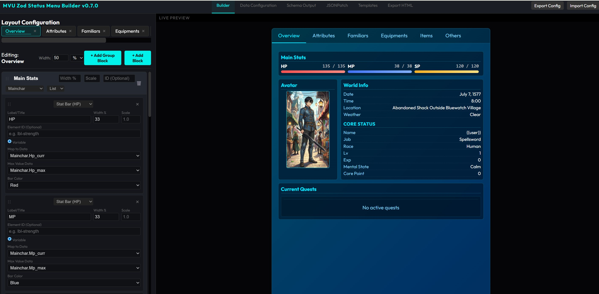

# MVU Zod Status Menu Builder

> A companion system that works with **any** MVU Zod based character card!

This Status Menu Builder is an advanced tool that allows you to build the layout of a status menu in any browser simply by clicking and dragging. All data is saved locally on your computer and remains persistent in SillyTavern. 

Because the data is pulled right out of a JSON file on your computer, the **AI is NOT required to remember your stats nor the state of your characters**. You simply instruct the AI on how to add, update, or remove data in the JSON file based on your own rules in plain English (or any language of your choice).

<div align="center">
  
</div>

📺 **[Watch the Usage Demo on YouTube](https://youtu.be/y_cFT5Ty6vg)**

---

## 🚀 Getting Started

All you need to do is download the release, extract it, and run it. No extensions are needed to *run the builder itself*:

1. 📥 **[Download the Latest Release](https://github.com/KritBlade/MVU_Zod_StatusMenuBuilder/releases)**
2. Unzip the downloaded file.
3. Double-click on `index.html` to open the builder in your web browser.

---

## ✨ Features

The builder allows you to create custom stats based entirely on your design with absolutely no limits on what variables you can track:

* 📊 **Data Configuration:** A utility that allows you to build sample data for your specific design.
* 📝 **Schema Output:** Defines the structure of your data so the AI knows exactly what format to follow when saving variables.
* 🧩 **JSONPatch Utility:** Automatically generates JSONPatch rules for you.
* 🎨 **Template System:** Completely change the colors and fonts of your status menu. You can also create custom templates for how you want to display item lists (e.g., inventory, equipment).
* ⚔️ **Logic Tab:** Equip or unequip gear dynamically. It automatically adds or removes equipment stat bonuses and recalculates your total stats accordingly.
* 🧠 **Advanced Field Logic:** Inject JavaScript logic directly into individual fields!
  * *Example 1 (Dynamic Styling):* `If Mainchar.level > 70, make the color of Mainchar.Name red.`
  * *Example 2 (Lorebook Integration):* Retrieve the content of *any* lorebook entry inside your SillyTavern story. `If Mainchar.Level > 70, retrieve the image URL from lorebook entry 'post-70-map' and display it; else, read from 'pre-70-map'.`

---

## ⚙️ SillyTavern Installation Requirements

While the *Builder* doesn't require extensions to run, your **character game card** *does* require two extensions to function correctly inside SillyTavern. 

📺 **[Full Installation Video Guide](https://www.youtube.com/watch?v=Jh1ojfiqGXI)**

**Step-by-Step Installation:**
1. **Install Tavern Helper:** Download it from **[this link](https://github.com/N0VI028/JS-Slash-Runner)**. 
   * *Tip:* You can change the Tavern Helper to an English menu by changing the SillyTavern Language to English, as shown below:
   <div align="center">
     
   </div>
2. **Install ST-Prompt-Template:** Download the extension from **[this link](https://codeberg.org/zonde306/ST-Prompt-Template/)**.
3. **Download a Compatible Preset:**
   * Get the **Izumi English Preset** from **[Discord](https://discord.com/invite/C6HabNwzn7)**.
   * *Alternatively*, the **[Megumin v5.0 Preset](https://github.com/Arif-salah/Megumin-Suite)** works perfectly as well with MVU compatiblity.
4. **Play!** The MVU Stats Menu builder works seamlessly with the **[ArtificRealm Character Card](https://github.com/KritBlade/ArtificRealm)**.

> **Why these extensions?** The character card and the builder heavily utilize *Tavern Helper* and *ST-Prompt-Template* to enable JavaScript inside SillyTavern. Tavern Helper alone has hundreds of thousands of active users in the Chinese SillyTavern community. As long as you have these two extensions installed, you can use any utility or character card built for them without needing to install anything else!

---
## FAQ
1. If you run into problem on CSS or structural issue which the output in SillyTavern doesn't match what it looks in the builder, go to Template Tab in builder and click on "StatusMenu(Global CSS), and then press the Reset to Default button on the right"

## 🛠️ Advanced Logic Guide

Here is a quick reference for writing custom logic inside the builder:

### Standard Variables (Non-Collections)
For any stat that is *not* inside a collection, the default pre-populated entry will read from the `"root"` source using the full path of the variable (e.g., `World.Date`). 

```javascript
// 'Default' is the fallback value if the variable is empty.
_output = getV(root, 'World.Date', 'Default');
